<h1>
    
Libraries, Pipelines & Releases

</h1>

- [1. Pre-requisites](#1-pre-requisites)
- [2. Release Pipeline Service Principal (Service Connection) Permissions](#2-release-pipeline-service-principal-service-connection-permissions)
- [3. Create service connection for the release pipelines using service principal/ app registraion](#3-create-service-connection-for-the-release-pipelines-using-service-principal-app-registraion)
- [4. Create app registration for SPA - Angular Application](#4-create-app-registration-for-spa---angular-application)
  - [4.1 Add authentication settings for the app registration](#41-add-authentication-settings-for-the-app-registration)
- [5. Create SQL Server Admin Group & domain user account](#5-create-sql-server-admin-group--domain-user-account)
- [6. Clone & update release pipeline variables](#6-clone--update-release-pipeline-variables)
  - [6.1 Libraries](#61-libraries)
- [7. Application Resource Deployment Pipelines](#7-application-resource-deployment-pipelines)
- [8. Create Dev ACR ServicePrincipal Secret](#8-create-dev-acr-serviceprincipal-secret)
- [9. Deploying Azure AppConfiguration Data](#9-deploying-azure-appconfiguration-data)
- [10. Deploying Pods for the application](#10-deploying-pods-for-the-application)
- [11. Deploying API Management Endpoints](#11-deploying-api-management-endpoints)
- [12. Import MavimCloud Certificate in to the KeyVault](#12-import-mavimcloud-certificate-in-to-the-keyvault)
- [13. Creating Azure Front Door for WopiHost](#13-creating-azure-front-door-for-wopihost)
- [14. Set permission for Azure Front Door to access KeyVault](#14-set-permission-for-azure-front-door-to-access-keyvault)
- [15. Create custom domain for the Azure Front Door](#15-create-custom-domain-for-the-azure-front-door)
- [16. Set permission for Azure CDN to access KeyVault](#16-set-permission-for-azure-cdn-to-access-keyvault)
- [17. Add Custom domain for CDN Endpoint](#17-add-custom-domain-for-cdn-endpoint)
- [18. Add Custom domain for the API Management](#18-add-custom-domain-for-the-api-management)
- [19. Creating URL Re-Write Rule for CDN](#19-creating-url-re-write-rule-for-cdn)
- [20. Deploy databases](#20-deploy-databases)

# 1. Pre-requisites

1. The user of this document should be familiar with `Azure Portal`, `DevOps` and release pipelines.
2. User should have access to the `Azure Portal` with owner privileges.
3. The user should have owner privileges to the respective `Azure Subscription`.
4. The user should have access to `DevOps Pipelines` and be able to modify the pipelines.

In order to work with pipelines and releases, one must go through this document in sequence as every chapter may depend on the previous one as a pre-requisite.

# 2. Release Pipeline Service Principal (Service Connection) Permissions

Azure Devops release pipeline uses a `Service Principal` account to connect and create resources on the Azure portal. For a DevOps release pipeline to be able to create resources within an Azure subscription and hence the resource groups within which the resources are created, the service principal account needs special permissions. This section describes in brief the necessary permissions required for the Service Principal as a pre-requisite before triggering the release pipelines.

1. Login to the Azure subscription.
2. Navigate to `App Registrations`
3. Create a new app registration that will be used as a service principal account for the release pipeline.

   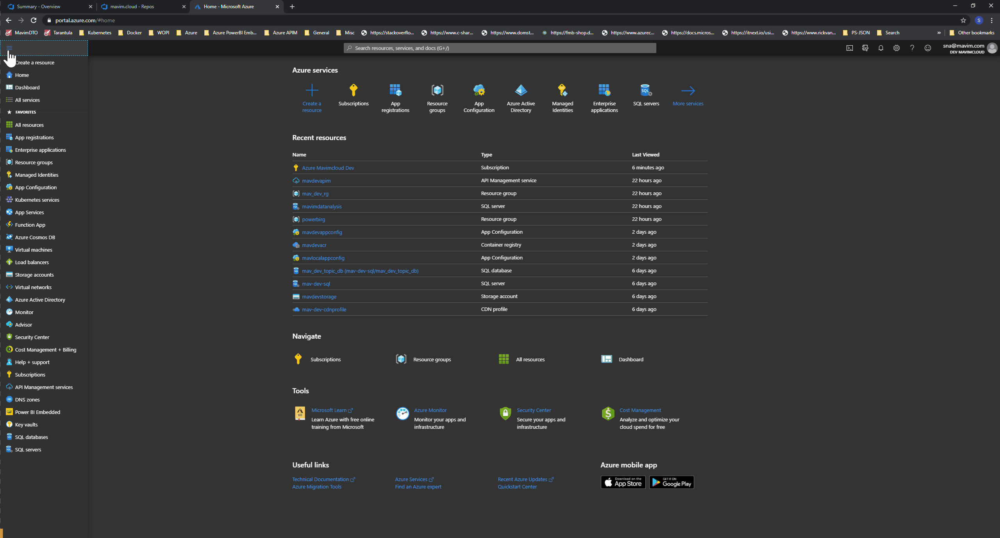

4. Navigate to the newly registered app.

   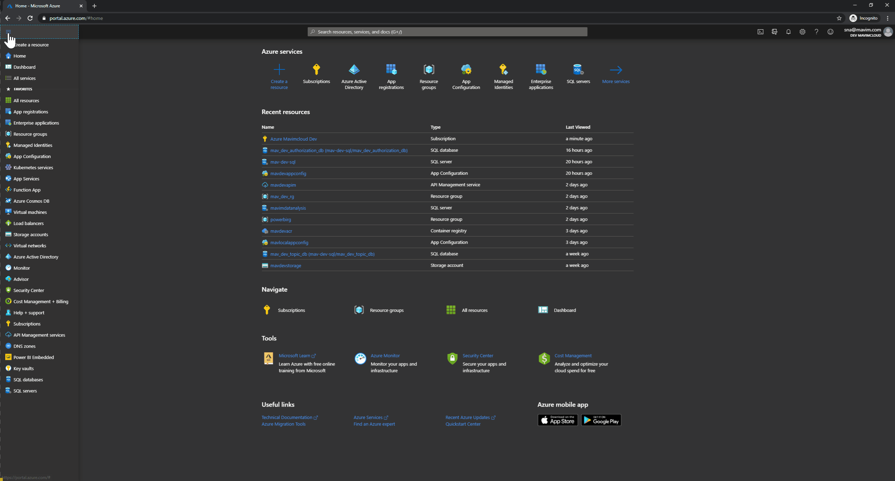

5. On the left pane, click on `API Permissions` under the `Manage` section and make sure to add the following permissions:

   a. `Azure Active Directory Graph` - `Application.ReadWrite.All`

   b. `Azure Active Directory Graph` - `Directory.ReadWrite.All`

   c. `Microsoft Graph` - `User.Read`

   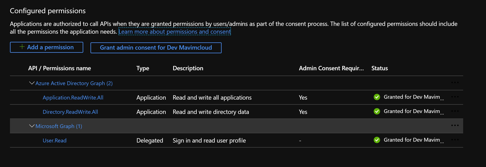

6. Navigate to the `Subscription` in the Azure portal.

   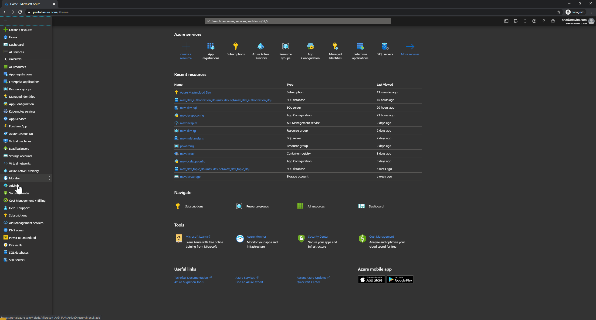

7. Navigate to the `Acces Control (IAM)` option and "Add role assignment" to the App registration created in the previous steps with `'Contributor'` and `'User Access Administrator'` roles.

   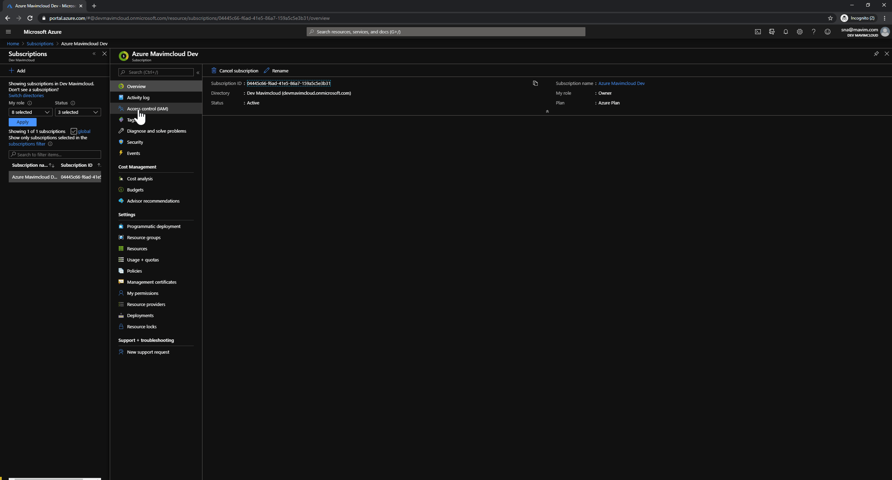

8. Create secret for the app registrion. Click on the `Certificates & secrets` option under `'Manage` section and click `New client secret` button to create new secret. After creating it, copy the value and store it in some secure place as you're gonna need it while configuring the release pipeline service connection later.

   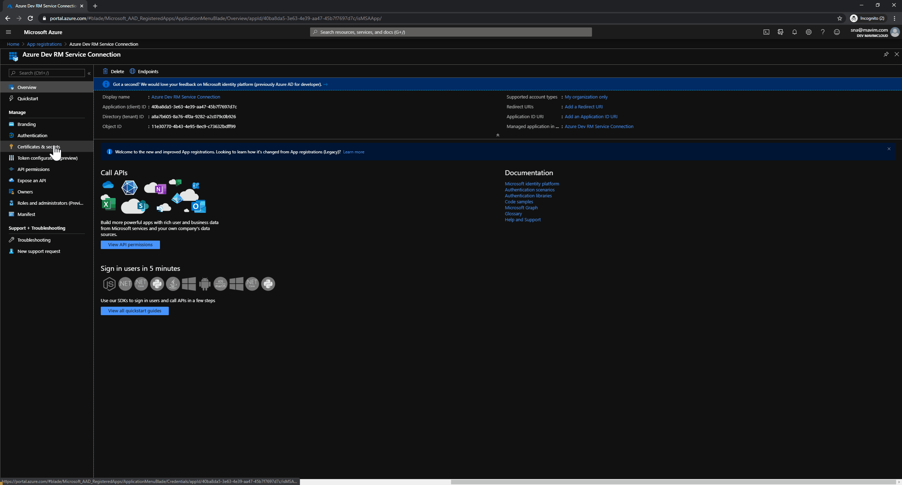

# 3. Create service connection for the release pipelines using service principal/ app registraion

This section describes how to create a service connection for the release pipeline which is used for creating shared resources on the Azure tenant.

# 4. Create app registration for SPA - Angular Application

1. Create a new App registration like in chapter 1. Follow the naming conventions `Mavim {EnvironmentName} Cloud` e.g: `Mavim Development Cloud`
2. Create a secret like in chapter 1. Follow the naming conventions `Mavim {EnvironmentName} Cloud Secret` e.g: `Mavim Development Cloud Secret`
3. On the left pane, click on `API Permissions` under the `Manage` section and make sure to add the following permissions:

   a. `Azure Sql Database` - `user_impersonation`

   b. `Microsoft Graph` - `User.Read`

   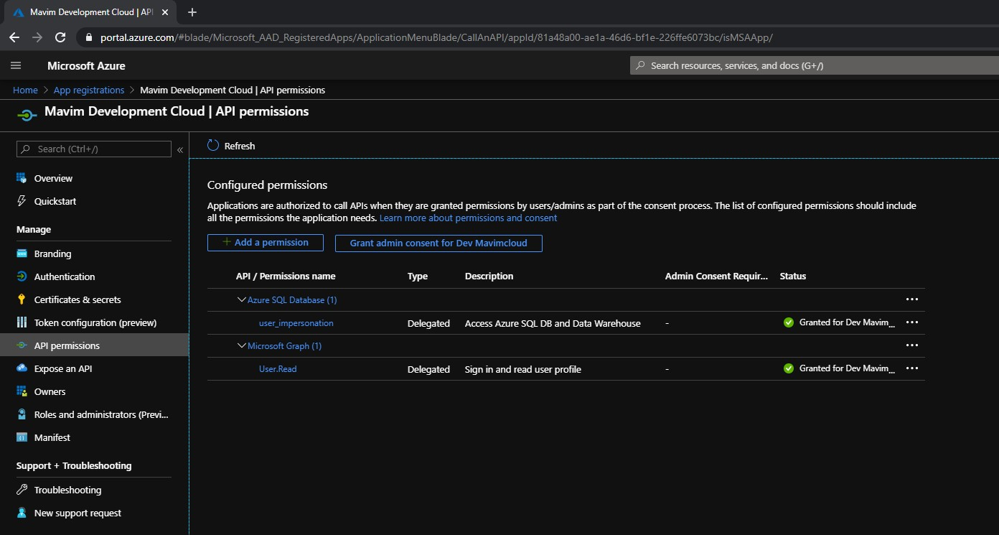

   ## 4.1 Add authentication settings for the app registration

   1. Navigate to App registration if not already in the app registration that was created in the previous steps.
   2. Once in the `App Registration` screen, click on the `Authentication` option under the `Manage` section in the left pane.
   3. Add the following entries for the `Redirect URIs` section

      - https://localhost:4200 - (Add this only if used for Development environment)
      - http://localhost:5000 - (Add this only if used for Development environment)
      - http://localhost:5001 - (Add this only if used for Development environment)
      - https://{env}-web.mavimcloud.com/index.html (eg: https://dev-web.mavimcloud.com/index.html)
      - https://global.consent.azure-apim.net/redirect
      - https://{env}-web.mavimcloud.com (eg: https://dev-web.mavimcloud.com)
      - https://{env}-web.mavimcloud.com/assets/auth/silent-refresh.html (eg: https://dev-web.mavimcloud.com/assets/auth/silent-refresh.html)

   4. Add `Implicit grant` options as below:
      1. Check `Access tokens`
      2. Check `ID tokens`

   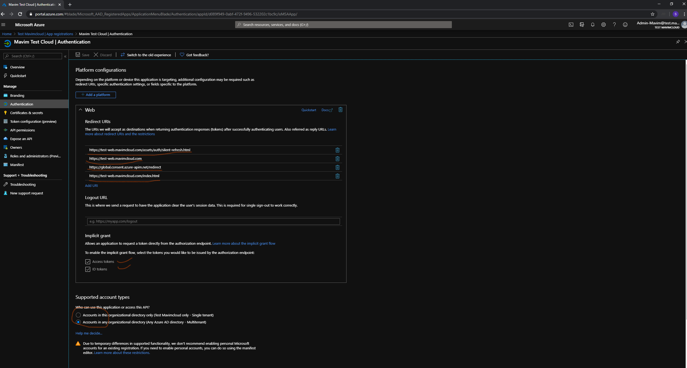

# 5. Create SQL Server Admin Group & domain user account

In the release pipeline for deploying shared resources for the SQL servers, the tasks contain steps to add permissions to the relevant databases in order for the `Managed Identities` to be able to access the dataabses. These permissions are set by executing sql scripts and the action requires a domain user (not sql user) in order to execute the scripts for permissions. Hence in this section we create a domain user in the active directory and set that user as a member of the sql admin group. Further, the user is utilized in the release pipeline variables and hence be sure to update the relevant pipeline variable as well.

1.  Create a domain user in the `Azure Active Directory` with the name `sqladminuser`.
2.  Once the user is created, copy the password for the user and store it in the `Secretes` of the `Key-Vault` in the Azure portal with the name `sqlDomainAdminUserPwd`. Keep in mind that the key-vault is created using the shared resource pipeline. So, once the Kye-Valut is created, this step can be performed to store the password. This is further used in the variables for the release pipelines while deploying sql resources for the specific applicaiton like `Topic`, `Catalog` etc.
3.  Create an SQL administrators group with the name `SqlAdminsGroup`.
4.  Add the user `sqladminuser` to the `SqlAdminsGroup` group.
5.  Set `SqlAdminsGroup` as the `Active Directory admin` for the Sql Server that will be created further for the applications.

# 6. Clone & update release pipeline variables

For every stage eg: Test, Demo, Acc, Prod, we need to clone the release pipeline variable groups in the `Libraries` and update the values accordingly. The steps to do this is briefly discribed below:

## 6.1 Libraries

This is the hierarchy of the variable groups:

- `Kubernetes Yaml File Names Variables` : Specifies the yaml files for the docker-compose to be used by the CI and pipeline build definitions
- `Nuget Release Variables` : Defines the nuget variables for the build to pull the nuget packages from our private feed.
- `Azure Kubernetes Configuration Transformation Variables` : Specifies the variables that are transformed for the kubernetes configuration.
- `00 Release Infra (global) variables` : This has to be used at release level & not stage level.
  - `Derived variables` : Variables that are derived from generic variables by using an existing variable or concatenating two or more variables. This has to be used at release level & not stage level.
- `Azure Kubernetes Configuration Transformation Variables` : Specifies the variables that are transformed for the kubernetes configuration.
- `00 Release Infra (global) variables` : This has to be used at release level & not stage level.
  - `Derived variables` : Variables that are derived from generic variables by using an existing variable or concatenating two or more variables. This has to be used at release level & not stage level.
    - `01 {ENV} Infra variables` eg: `01 Dev Infra variables` : Used for the respective environment infrastructure variables. This has to be used at stage level & not release level.
    - `{ENV} - 01 Frontend Application Variables`: For the frontend application variables transformation
    - `{ENV} - 02 {APPLICATIONNAME} Application Variables` eg: `Dev - 02 Topic Application Variables` : Environment & Application specific variables. This has to be used at stage level & not release level.

These are the steps to follow in order to create a new staging for the release pipelines:

1.  Clone the existing stage in the release pipeline f e.g: `Dev` say for `Test`.

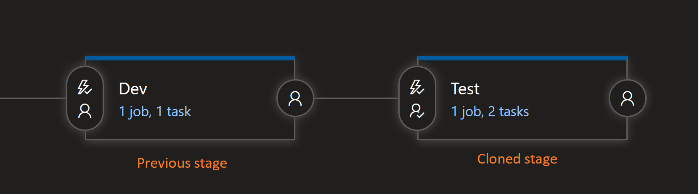

**NOTE:** Once you have cloned the stage, the varible groups that were already existing for say `Dev` will be marked as to be used also for `Test`. So be careful to `Unlink` the `Dev` variable groups from the `Test` stage.

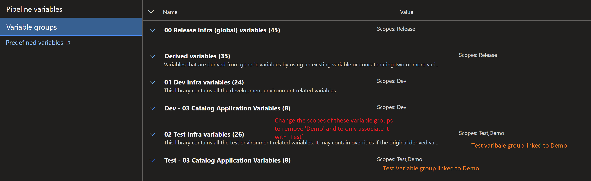

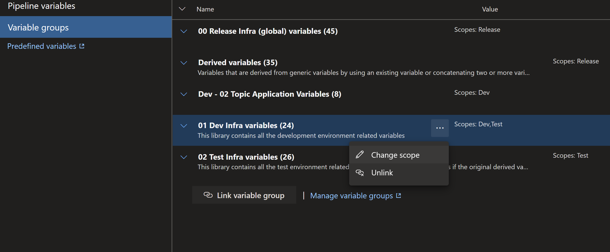

1.  Link the variable groups for the new stage environment in the variable groups section. Take a look at the existing variable groups that are linked for the previous stage. Clone the varibale groups (if not existing) from the previous stage environment groups.
2.  Update the variable groups with the values corresponding to the new environment.

**NOTE:** When you clone the stage say `Dev` to `Test`, make sure that all the Tasks (**NOT TASK GROUPS. TASK GROUPS DO NOT CHANGE.**.) inside the new stage are using the respective stage service connection.

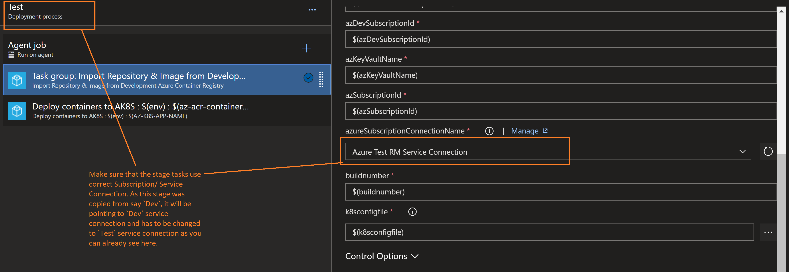

# 7. Application Resource Deployment Pipelines

One must deploy resources for the specifc application before releasing the `Azure Kubernetes Pods` or `API Management endpoints`.

**NOTE:**
Before Running Topic/ Catalog/ Authorization/ Wopi Resource Deployment pipelines make sure that you have done the following:

For executing scripts from the pipeline for setting the permissions on the database, the powershell script is used. This requires the usage of an domain user that has admininstrator privileges for the Sql database server. Hence we need to create a domain sql admin user e.g., `sqladminuser@domain.com` and **NOT** sql server local admin account i.e, `sqladmin`.

1. Create `sqlDomainAdminUserPwd` secrete with pwd that was set while creating the domain user for sql admin i.e., `sqladminuser@{env}mavimcloud.onmicrosoft.com`

**NOTE:**
The password set should be changed for the first time by trynig to login to the portal, as this is a domain user, as the domain user is generally required to change the password.
You can do so by logging in to the Database using SQL Management Studio or Azure Data Studio and then you get an option to change the default pwd for the first time and then it should be good to proceed further.

2. Make sure to add sqladminuser to the SqlAdminGroup
3. Add SqlAdminGroup as 'Active Directory Admin' for the Sql Server that was created by the Azure Resource Group pipeline.
4. Make sure in the Sql Server Firewall and Virtual Networks section enable "Allow Azure services and resources to access this server" option otherwise you'll see errors as below when the release pipeline runs

   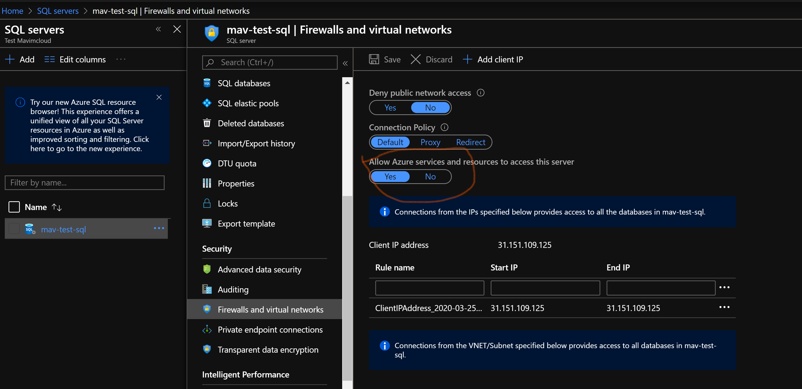

   "Cannot open server 'mav-test-sql' requested by the login. Client with IP address '52.232.22.131' is not allowed to access the server. To enable access, use the Windows Azure Management Portal or run sp_set_firewall_rule on the master database to create a firewall rule for this IP address or address range. It may take up to five minutes for this change to take effect."

The following are the resource deployment pipelines:

- Deploy Frontend Resources
- AuthApi : Deploy Resources
- Catalog : Deploy Resources
- Topic : Deploy Resources
- WopiFileLock : Deploy Resources
- Wopi : Deploy Resources

5. Make sure that you change the Subscription Service Connection to the appropriate Azure Environment otherwise you risk over writing or creating resources in unintended azure subscription.

# 8. Create Dev ACR ServicePrincipal Secret

Once all the Azure resources are created (including the KeyVault). Create a secret in the KeyVault with the name `Dev-ACR-ServicePrincipal` with the secret value as that in the `Test` environment. This is used by the pod release pipeline to import the docker images from the Dev environment. This secret is of the RBAC/ service princiapl account `mav-dev-rbac-SP` on the dev environment that has access to Azure Container Registry as shown in the second screen shot below.

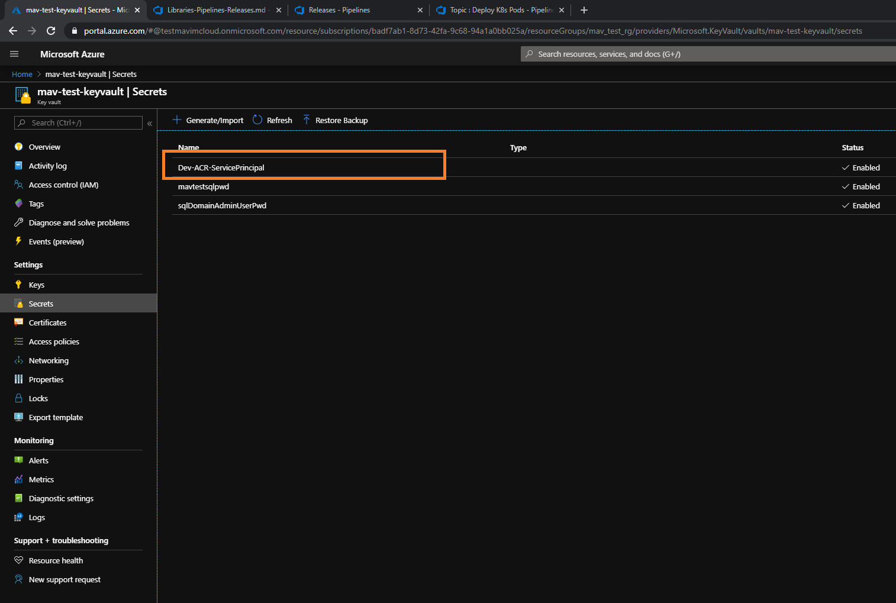

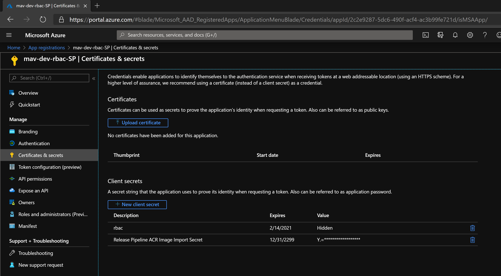

# 9. Deploying Azure AppConfiguration Data

Before deploying pods on to the Azure Kubernetes Cluster, one must make sure that the Azure AppConfiguration data is deployed as the pods connect to the AzureAppConfiguration for initial settings.

The release pipeline that must be deployed is as follows:

- Deploy AzAppSettings Data

# 10. Deploying Pods for the application

Run the release pipelines for the desired application i.e, Topic/ Catalog. Authorization/ WopiHost. Once the release is complete, the load balancer services should be created with internal IP addresses that can be obtained using the `**kubectl**`.

The following are the Pod deployment release pipelines:

- AuthApi : Deploy K8s Pods
- Catalog : Deploy K8s Pods
- Topic : Deploy K8s Pods
- Wopi : Deploy K8s Pods

# 11. Deploying API Management Endpoints

Once the pods are deployed (as in Chapter 7), before triggering the release of the API management endpoints, you should get the IP addresses of the API services deployed on to the namespaces **`mavim-public`** and change the pipeline variables of the respective environment to these IP addresses.

The following are the API Management release pipelines:

- AuthApi : Deploy APIM EndPoints
- Catalog : Deploy APIM EndPoints
- Topic : Deploy APIM EndPoints
- Wopi : Deploy APIM EndPoints

# 12. Import MavimCloud Certificate in to the KeyVault

1.  Navigate to the Azure KeyVault `mav-{env}-keyvault` that was created by the `Shared Azure Resources` release pipeline.
2.  Click on the `Certificates` option under the `Settings` section.
3.  Click on `+ Generate/ Import` button.
4.  Under the `Method of Certificate Creation`, select `Import` option.
5.  Enter the certificate name as `MavimCloudCertificate`
6.  Select the file `Mavimcloud.pfx` (Get access to the pfx file before hand and store it on the local machine and have the password before hand)
7.  Enter the password.
8.  Click on `Create` button to import the certificate.

    

# 13. Creating Azure Front Door for WopiHost

1.  Navigate to the `Home` screen on the portal.
2.  Under the `All Services` option in the menu, search for `Azure Front Door` option and Add new to create Azure Front Door resource for the environment.
3.  Follow the onscreen instructions as shown in the animated gif below:

    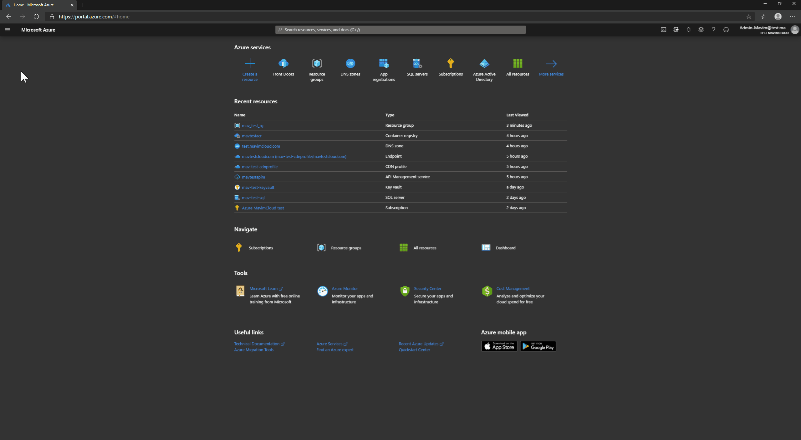

# 14. Set permission for Azure Front Door to access KeyVault

1.  First of all Azure Front Door requires permission to access the KeyVault and the certificate that we imported in the chapter 10. Look at the link for more detail: https://docs.microsoft.com/en-us/azure/frontdoor/front-door-custom-domain-https.
2.  In short, we need to open the `Cloud Shell` in the portal and execute the following command in order to give permission to the Azure Front Door to access the certificate from the keyvault.

          New-AzADServicePrincipal -ApplicationId "ad0e1c7e-6d38-4ba4-9efd-0bc77ba9f037"

3.  Once the above command succeeds, navigate to the KeyVault.
4.  Click on `Access Policies` option under the `Settings` section.
5.  Click on `Add Access Policy`.
6.  Select `Key, Secret & Certificate Management` option under the `Configure from Template` options.
7.  Click on `Select Principal` and type `ad0e1c7e-6d38-4ba4-9efd-0bc77ba9f037` in the search box.
8.  Select the Azure.Front.Door service principal and click Add.
9.  Click `Save` to apply the changes.

    

# 15. Create custom domain for the Azure Front Door

1.  Navigate to the Azure Front Door that was created in the previous chapter.
2.  Click on the `Front Door Designer` under the `Settings` menu.
3.  Click on the `+` in the `Frontends/ domains` option.
4.  Enter the `Custom host name` as `{env}-wopi.mavimcloud.com`.
5.  Enable HTTPS protocol.
6.  Select `Use my own certificate` option
7.  Select KeyVault where the certificate was imported.
8.  Select the certificate under secret dropdown.
9.  Select the `Secret version` from the dropdown.
10. Click on `Add`
11. Select the existing routing rule that was created when the Front Door was initially created.
12. Update the `Frontends/domains` to select the new domain that was added in the previous steps and uncheck the default domain.
13. Click `Update` and click `Save` to apply changes for the Front Door.

# 16. Set permission for Azure CDN to access KeyVault

you need to setup the right permissions for CDN to access your Key vault:

1.  Register Azure CDN as an app in your Azure Active Directory (AAD) via PowerShell (Cloud Shell) using this command: New-AzureRmADServicePrincipal -ApplicationId "205478c0-bd83-4e1b-a9d6-db63a3e1e1c8".
2.  Grant Azure CDN service the permission to access the secrets in your Key vault. Go to “Access policies” from your Key vault to add a new policy, then grant “Microsoft.Azure.Cdn” service principal a “get-secret” permission.

# 17. Add Custom domain for CDN Endpoint

1.  Navigate to the CDN Endpoint under the CDN Profile.
2.  Click on `Custom domains` under `Settings` section and click on `+ Custom domain`.
3.  Follow the onscreen instructions to complete the process as shown below:

NOTE: Make sure to set the `Path` value in `Backend pools` to "/v1/version" as shown in the animated gif below.

# 18. Add Custom domain for the API Management

1.  Navigate to the API Management
2.  Click on the `Custom Domains` under `Settings` section.
3.  Click on `+ Add` button.
4.  Enter the host name as `{env}-api.mavimcloud.com`
5.  Select certificate as `Key Vault`
6.  Select the Key Valut `{mav}-{env}-keyvault`.
7.  Select the certificate from the drop down.
8.  Enter the password and select `Default SSL Binding`.
9.  Click on `Add` button.

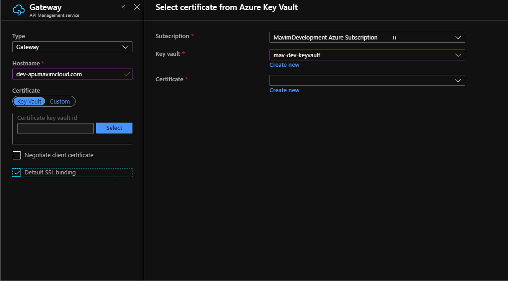

# 19. Creating URL Re-Write Rule for CDN

1. Navigate to the CDN Profile in the Azure Portal.
2. Click on the `Manage` in `Overview` view.

   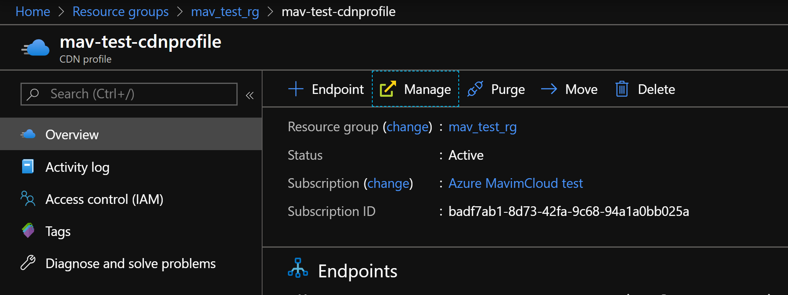

3. In the web page that opens in a new tab, choose the option `Http Large` --> `Rules Engine` from the top menu.
4. Enter the name/ description for the rule as `IndexPage` and click `Add`.
5. Click on `+` for the `Features` and select the value `Request Header Wildcard` in the first drop down.
6. In the `Name` textbox, type `User-Agent` and select `Does Not Match` option in the next dropdown.
7. In the `Value(s)` text box enter `ECPurge/*` as value.
8. Select `URL Rewrite` as the option in the next dropdown.
9. Enter pattern as `[^?.]*(\?.*)?$`
10. Leave the destination as default value in the dropdown. \*\*
11. In the last text box enter the value as `{storagecontainername}/index.html`
12. Click `Save`
13. It generally takes 4 hours to reflect the URL rewrite changes on to the CDN.

10) \*\* With Rules Engine V4.0 the origin does not have a default value, yet is required for the Url-Rewrite. You can find the origin by creating a new rule.
    In this new rule choose Match -> Origin -> Origin Customer. In the select you can view the origin, copy that value and use it in the source and destination as the prefix of the values in step 9 and 11. Don't forget to remove this rule when you have supplied the origin.

# 20. Deploy databases

The following databases need to be deployed/ updated with values in order to continue with the application.

1. Mavim Database : After deploying everything, keep in mind that one needs to deploy the Mavim database. You can use the sqladminuser that was created in one of the previous chapters to connect to the database using the Mavim Manager and restore a copy of the database.
2. Authorization Database : Users `oid` need to be added to the table.
3. Catalog Database : DBIds need to be added to the table.
