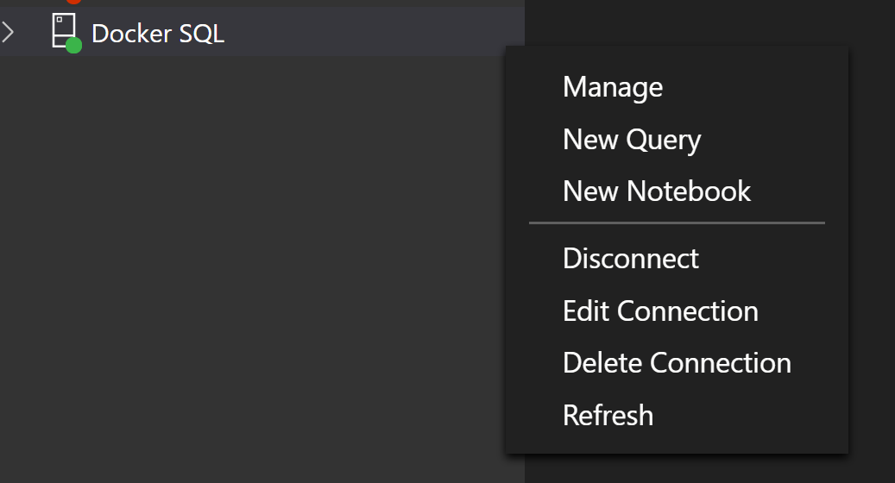

<h1>
    
MSSQL Docker Container Setup for development machines

</h1>

- [1. Pre-requisites](#1-pre-requisites)
- [2. Download the tar file from Microsoft Teams](#2-download-the-tar-file-from-microsoft-teams)
- [3. Create a SQL server container with volume](#3-create-a-sql-server-container-with-volume)
- [4. Extract the backup files to container data volume](#4-extract-the-backup-files-to-container-data-volume)
- [5. Restore the bak files](#5-restore-the-bak-files)
- [6. Stop the running sql server container](#6-stop-the-running-sql-server-container)

# 1. Pre-requisites

1. Docker Engine for Windows/ Mac - Latest version installed
2. Sql Management Studio OR Azure Data Studio latest version installed
3. Basic know-how about docker commands
4. Access to Microsoft teams location to copy the tar file for the databases

# 2. Download the tar file from Microsoft Teams

1. Navigate to the Microsoft teams and download the 'backup.tar' file from the location:

   `https://teams.microsoft.com/_#/files/General?threadId=19%3Afdf1aa669a48433f8520d90f46dbc022%40thread.skype&ctx=channel&context=Docker-Data-Volume&rootfolder=%252Fsites%252FProjectTarantula%252FGedeelde%2520documenten%252FGeneral%252FMavimManager-Releases%252FDocker-Data-Volume`

2. Create a folder named "volumebackup" on one of the logical drives on the machine.
3. Copy the downloaded tar file to the folder `volumebackup` that was crated in the above step.

# 3. Create a SQL server container with volume

1. Open a command prompt or a terminal on the machine.
2. Execute the following command:

   > `docker run -it -e 'ACCEPT_EULA=Y' -e 'MSSQL_SA_PASSWORD=MavDev2020*' -p 14333:1433 -v sqlvolume:/var/opt/mssql -d mcr.microsoft.com/mssql/server:2019-CU5-ubuntu-18.04`

3. Execute the following command to make sure that the container is running

   > `docker ps`

The output should see something like below:

4. Once the Sql Server container is running, open the Sql Management Studio / Azure Data Studio.
5. Create a connection with the following details:
   - Server - `localhost, 14333`
   - Authentication Type: `SQL Login`
   - User name - sa
   - Password - `MavDev2020*`

6. Click Connect to get connected to the Sql Server instance running inside the docker container.

# 4. Extract the backup files to container data volume

1. Open a new command/ terminal window.
2. Execute the following command: This command will download and create an alpine container (~5MB in size) and loads the sqlvolume so that the same can be used later to extract the backup files on to the sqlvolume using the backup.tar that was downloaded from Microsoft teams during the previous chapters.

   > `docker run -it -v sqlvolume:/sqlvolumebckup --name sqlserverbckupvol alpine /bin/sh`

3. Keep the above command prompt open for debugging purposes (if required)
4. Open a new command/ terminal window prompt and execute the following command:

   > `docker run --rm --volumes-from sqlserverbckupvol -v <FULL PATH OF THE LOCATION WHERE backup.tar WAS COPIED>:/backup ubuntu bash -c "cd /sqlvolumebckup/data && tar xvf /backup/backup.tar"`

   > `Example: docker run --rm --volumes-from sqlserverbckupvol -v d:/volumebackup:/backup ubuntu bash -c "cd /sqlvolumebckup/data && tar xvf /backup/backup.tar"`

5. SKIP this step as it is not necessary unless it is out of curiosity:
   Once the above command executes successfully, make sure to go back to the first command prompt/ terminal (opened in step 1) and check the contents of the path sqlvolume/data/backup/data/

# 5. Restore the bak files

1. Open the Azure Data Studio with the connection details explained in the previous chapters
2. Right click on the sql connection and click `Manage`
   

3. In the manage tab, click on `Restore` option
   

4. In the `Restore from` option select `Backup file'
   

5. Select the bak files one at a time and restore the databases:
   

# 6. Stop the running sql server container

Once all the databases are restored from the backup, stop the sql server container that was created in the previous chapter, as this will be restarted when running the application from the Visual Studio using the docker compose file.

> `docker ps` - to get the running containers and copy the container id for sql server
>
> `docker stop <CONTAINERID>` - to stop the running container.
