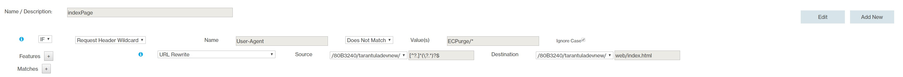
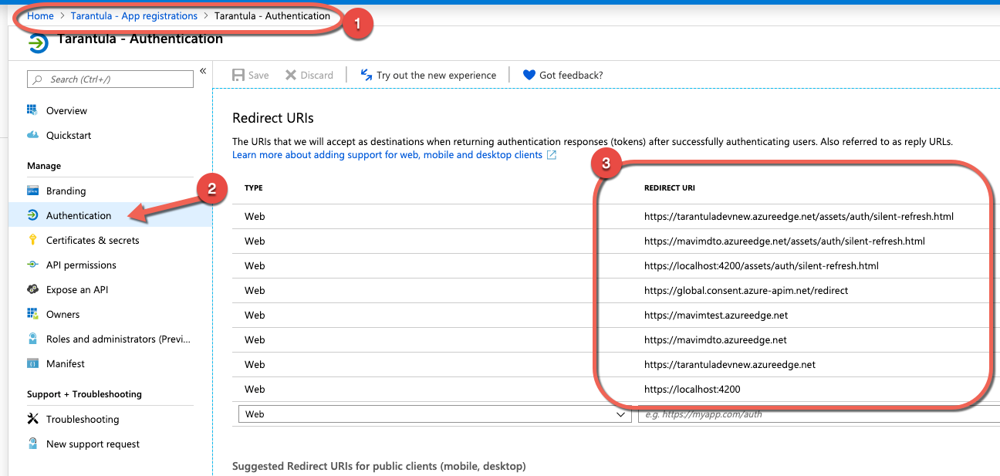

# Azure configuration

## 1. CDN profile

1.1 Verizon configuration

For the Angular application it is necessary that for all requests, the URL is rewritten to redirect to the index.html file. The requests are then picked up by the Angular routing and the correct page is opened. If the URL rewrite is not in place, navigating to the page will result in a 404 NOT FOUND error.
The regular expression to rewrite the URL is based on 2 articles:

- [Azure CDN with Verizon - Rewriting URL to always load index.html](https://stackoverflow.com/questions/49401118/azure-cdn-with-verizon-rewriting-url-to-always-load-index-html/49509042)

- [Azure CDN rules engine to add default document EXCEPT for files requested by the site](https://stackoverflow.com/questions/47071582/azure-cdn-rules-engine-to-add-default-document-except-for-files-requested-by-the/49416298#49416298)

On the CDN profile page, select: 'manage' to go to the Verizon configuration panel.
In the menu, go to HTTP Large and select: 'Rules engine'.
Create a new rule with a unique name:

- IF [Request Header Wildcard] Name: User-Agent [Does Not Match] Value(s) ECPurge/*
  FEATURE: [URL Rewrite] Source: [*prefilled*] [^?.]*(\?.*)?\$ Destination: [*prefilled\*] [blob storage folder name]/index.html

See also the image:

## 2. OAuth

2.1 Oauth Redirection

To refresh your tokens when using implicit flow you can use a silent refresh. This is a well-known solution that compensates the fact that implicit flow does not allow for issuing a refresh token. It uses a hidden iframe to get another token from the auth server. When the user is there still logged in (by using a cookie) it will respond without user interaction and provide new tokens.

- [Refreshing when using Implicit Flow (not Code Flow!)](https://github.com/manfredsteyer/angular-oauth2-oidc/blob/master/docs-src/silent-refresh.md#refreshing-when-using-implicit-flow-not-code-flow)

Steps:

1. https://portal.azure.com/#home
2. Check if you are in the right directory (tarantula)
3. Click on Azure Active Directory
4. App registration
5. Select the app that is responsable for your enviroment.
   dev: Tarantula
   dto: MavimDTO
6. Click on Authentication
7. Now you see on the right a list of redirect uri's. Add here your new enviorment url.

See also the image:

