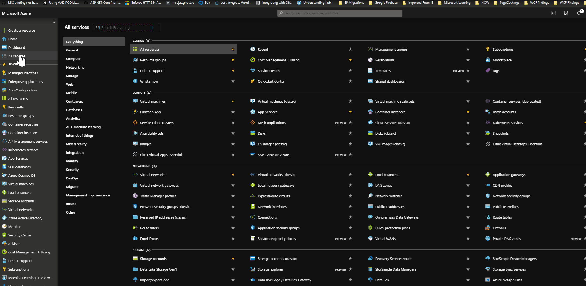

<h1>
    <p style="text-align: center;background-color:Gray;color: white">Developing with Azure App Configuration</p>
</h1>

- [1. Introduction](#1-Introduction)
- [2. Pre-Requisites](#2-Pre-Requisites)
- [3. Azure App Configuration](#3-Azure-App-Configuration)
  - [Create your Azure App Configuration](#Create-your-Azure-App-Configuration)
- [4. User-Secrets](#4-User-Secrets)
  - [How to create user-secret?](#How-to-create-user-secret)
- [3. Create MIC and NMIs on Kubernetes cluster(NOT FOR DEVELOPMENT MACHINE)](#3-Create-MIC-and-NMIs-on-Kubernetes-clusterNOT-FOR-DEVELOPMENT-MACHINE)
- [4. Appendix](#4-Appendix)

# 1. Introduction

This document makes an effort to describe the steps needed to set up Azure App Configuration and to use the same during the development phase.

# 2. Pre-Requisites

- Azure account with subscription.
- Azure CLI installed on the local machine. (Required during development)
- .Net Core 3.0 framework

# 3. Azure App Configuration

NOTE: Please do not use the same App Configuration as common way to connect to, as the code as of now does not use 'labels' to filter out the configuration values. For now, it is recommended that for development every developer creates his/her own Azure App Configuration on the portal and connects to it during development.

## Create your Azure App Configuration

```
NOTE: If not already logged on to the Azure (and if prompted), please login using the command

az login -g <Resource Group Name> --subscription <Subscription id optional if there are multiple subscriptions>
```

Then execute the below script to create Azure App Configuration.

```
az appconfig create -n <Name of your App Configuration> -g <Resource Group Name> -l westeurope
```

# 4. User-Secrets

For applications it is always a good practice to not store any of the secrets or connection strings with passwords in the configuration files, as this could potentially expose sensitive information to the not intended audience. Dotnet core provides a solution to this, by creating secrets and storing them in a secrets.json file for a user under his/her own profile with the help of "user-secrets" tool. This tool is already installed with the dotnet Cli. With this option of creating secrets.json, the secrets are not stored anymore in the configuration files, instead during runtime, dotnet core automatically loads the secrets.json depending on the "ASPNETCORE_ENVIRONMENT" to load all the connectionstring and password information to provide to the application.

## How to create user-secret?

1. Open a command prompt or PowerShell terminal and execute the following command:

```
az extension add -n appconfig
```

2. In the command prompt navigate to the folder location of the "Mavim.Manager.Api.Topic.csproj" project
3. Please replace the placeholder for the name with the value provided as below, as the name has to match with what the code is looking for in this case it is "AzAppConfig:ConnectionString:Dev".

```
dotnet user-secrets set <AZAPPCONFIG_SETTINGS_NAME> <CONNECTION_STRING>

Replace the placeholders above with values given below:

<AZAPPCONFIG_SETTINGS_NAME> : AzAppConfig:ConnectionString:Dev
<CONNECTION_STRING>         : Connection string from the Azure App Configuration "Access keys" section. Look below for the screen shot on where to look for this.
```



# 3. Create MIC and NMIs on Kubernetes cluster(NOT FOR DEVELOPMENT MACHINE)

Execute the following command in the command prompt while using the correct context (kubectl config get-contexts), in order to deploy kubernetes managed identity controller (MIC) and Node Managed Identity (NMI) daemons.

This command is only for the kubernetes running with RBAC-enabled (Role based access control) cluster.

```
kubectl apply -f https://raw.githubusercontent.com/Azure/aad-pod-identity/master/deploy/infra/deployment-rbac.yaml
```

# 4. Appendix

More information on:

https://docs.microsoft.com/en-us/azure/azure-app-configuration/overview
https://docs.microsoft.com/en-us/azure/azure-app-configuration/enable-dynamic-configuration-aspnet-core
