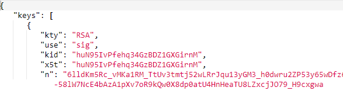
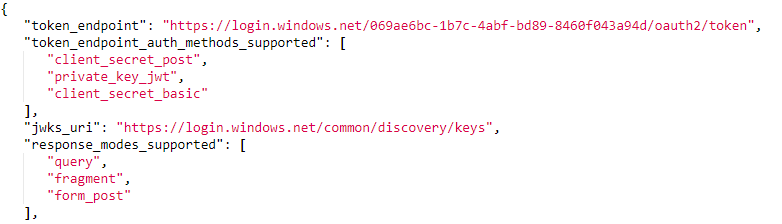
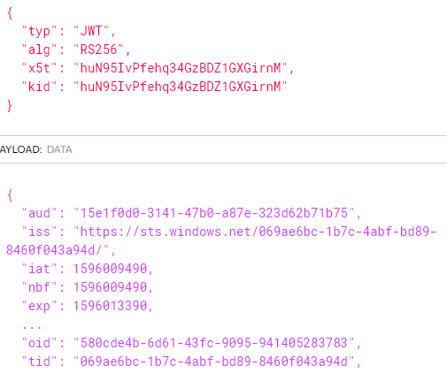

The ValidateIssuerSigningKey and ValdiateIssuer properties indicate that the token’s signature should be validated and that the key’s property indicating it’s issuer must match an expected value. This is an alternate way to make sure the issuer is validated since we’re not using an Authority parameter in our JwtBearerOptions (which would have implicitly checked that the JWT’s issuer matched the authority). Instead, the JWT’s issuer is matched against custom values that are provided by the ValidIssuer or ValidIssuers properties of the TokenValidationParameters object.

see: https://devblogs.microsoft.com/aspnet/jwt-validation-and-authorization-in-asp-net-core/

In my words, when you implement "ValidateIssuerSigningKey" then you validate to which issuers you are validating, instead of the default way of validating.

With the default setting ValidateIssuer = true; the JWT is validated if there is no tampering with the JWT. This is done by first checking if the token itself is valid signed. Then the signingkey hash is checked agains the idp URI where the token claims to be from.

In our solution we expect that we have a tid (Tenand ID) and iss (Issuer) and validate this against our list in the database.

---

Lets say that we have our own IDP, then its possible to create a own JWT. This token then can contain every claim that we like.

Lets day you want to force a JWT with the tid to "069ae6bc-1b7c-4abf-bd89-8460f043a94d" then when we get this token, this claim is there and could fool us.

(see: https://tools.ietf.org/html/rfc7519#section-4.1)

Luckily we also check for the iss claim. So lets put also "https://sts.windows.net/069ae6bc-1b7c-4abf-bd89-8460f043a94d/" as iss claim. In this case AAD will validate this issuer by going to the URL "https://sts.windows.net/069ae6bc-1b7c-4abf-bd89-8460f043a94d/.well-known/openid-configuration".
Then it searches for the JSON value:
"jwks_uri": "https://login.windows.net/common/discovery/keys",

Accessing this URI (https://login.windows.net/common/discovery/keys) it will find the (hashed) keys where the JWT is signed with. validating this against the to the JWT kid claim.

And now the circle is round.
