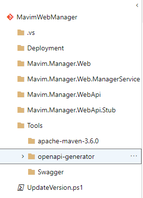

<h1>
    <p style="text-align: center;background-color:Gray;color: white">Swagger, OpenApi generator and Docker for Mavim</p>
</h1>

- [1. Introduction](#1-introduction)
- [2. Pre-requisites](#2-pre-requisites)
- [3. Why Swagger?](#3-why-swagger)
- [4. Why Docker?](#4-why-docker)
- [5. Swagger-Codegen](#5-swagger-codegen)
- [6. OpenApi-Generator](#6-openapi-generator)
- [7. Changes to OpenApi-Generator](#7-changes-to-openapi-generator)
- [8. Compile modified OpenApiGenerator](#8-compile-modified-openapigenerator)
- [9. Create Docker Image/ Container](#9-create-docker-image-container)
- [10. Generate code from docker container](#10-generate-code-from-docker-container)
- [11. Appendix](#11-appendix)

# 1. Introduction

This intention of this document is to describes the following, so that the developers can get acquaintance with swagger and docker and get on to the speed with minimal required knowledge.

**NOTE:** For further and necessary readings on the docker and swagger, please see the appendix section of the document.

- Why is swagger used (in brief)?
- Why is docker used (in brief)?
- OpenApi Generator tool overview and pros of it against others.
- Why do we need to modify the openapi generator code obtained from the Github?
- What was modified in the default java code obtained from the openapi generator tool code from Github?
- How to compile the modified generator code in the openapi generator tool.
- How to create a docker image/ container with the modified openapi generator tool code?
- How to generate the following using the docker container:
  - WebApi
  - WebApi Stub
  - Angular Service

# 2. Pre-requisites

- Docker for Windows (Look at appendix for download link).
- An account with the Docker hub to be able to pull and utilize the base images.
- Visual Studio 2017 or latest (for WebApi & related projects).
- VS Code (for angular project).
- JRE 8.0 or later, JDK 11.0.1 or later
- Apache-maven-3.6.0 (this can be found in the Mavim GIT repository under Tools)

# 3. Why Swagger?

Swagger was the original name for the OpenApi specifications. Swagger provides a way to model APIs with accuracy, visualize while APIs are being designed and helps in standardizing the design styles across the teams. Swagger provides the following services that help the teams to work with open api specifications:

- **Swagger Hub** - _The design and documentation platform for teams and individuals working with the OpenApi._
- **Swagger Inspector** - _Easily test and try out APIs right from your browser, and generate OpenAPI specification definitions in seconds_
- **Swagger Codegen** - _Generate server stubs and client SDKs from OpenAPI specification definitions_
- **Swagger Editor** - _API editor for designing APIs with the OpenAPI specification_
- **Swagger UI** - _Visualize OpenAPI Specification definitions in an interactive UI_

It allows the cross functional teams to define the requirements of the API in a human readable YAML format or JSON format that can further be utilized by the swagger code generator to generate the code for the APIs using many templates (Asp.Net Core, Java, C# Client, TypeScript/ Angular Services Code etc.)

# 4. Why Docker?

Swagger tools can be utilized online with the help of swagger hub. However, using swagger hub would mean manual intervention of the developers to create the APIs and the API related codes. Also, the free account does not enable the developers to collaborate and work with the online tools for the generation of API and related codes. This would mean that the swagger definition file has to be maintained outside of the swagger hub and synchronized with every update made by the developers which is error prone and cumbersome. Further, swagger can also be used offline by downloading the offline version of the swagger generator that can then be utilized to generate the API and related code. However, this would also mean that every developer would be required to install the pre-requisites for the **Swagger generator** like **_java (specific version), JRE (specific version) etc_** and then configure them by creating relevant environment variables. This would also be error prone and requires a lot of other documentation for the configurations.

This led to a thought of automating the API and related code generation and still be able to implement OpenAPI specifications with the help of swagger. So, how dow we do that?

**Docker to the rescue**. Docker enables us to create an image/ container that can be pre-constructed with all the pre-requisites/ components (like _java, JRE_) in it. Along with this, we can also compile the _OpenApi Generator_ code and push it to the docker image. This enables us to use the same docker image to generate our API and related code without having to worry about installing any of the pre-requisities ourselves on our machine, as the docker containers are already self contained with the pre-requisities and ready to use. This mitigates the risks with mismatches in the development machine configuration and reduces the mundane work for every developer.

# 5. Swagger-Codegen

Swagger has its own docker image on the docker hub that utilizes **Swagger-Codegen**. However, below are the reasons why it was not considered for the generation of API and related code:

- [x] The generated code for **asp.net core** does not implement IOC(Inversion of Control/ Dependency Injection). This is especially required if we have to automate the generation of API code without affecting/ overwriting the existing businesslogic within the api controller classes.
- [x] The code that it generates for the WebAPI and the typescript/ angular service is not all that good, not that up-to-date with versions and not clean.
- [x] The templates are outdated.
- [x] The documentation on the github for the swagger-api/swagger-codegen is not all that comprehensive as well. T
- [x] The docker images on the docker hub is also not that actively maintained.

# 6. OpenApi-Generator

OpenAPITools is the new **Swagger** generator tool and is actively maintained on the **Github** and even has better documentation to update the existing templates or to even add a custom template to the existing list of templates and create our own flavor of the open api generator/ codegen. At present, the docker image created by the OpenAPI Generator is also actively maintained. Further more, the reason why OpenApi-Generator became a strong contender was the fact that it was easier to create a new code generator that implements dependency injection by using an existing code generator class.

# 7. Changes to OpenApi-Generator

Below are the changes made to the OpenApi-Generator in order to achive generation of custom asp.net core api code with dependency injection:

1. Clone the code of openapi-generator from https://github.com/OpenAPITools/openapi-generator.git (The source code now resides under our Mavim git repository under the folder .\Tools as seen below in the screen shot). The apache-maven-3.6.0 is the maven server downloaded from the maven site, which is a pre-requisite for the openapi-generator project.

   

2. Created **_AspNetCoreIocServerCodegen.java_** class Under the folder structure _"Tools\openapi-generator\modules\openapi-generator\src\main\java\org\openapitools\codegen\languages"_.
3. The class **_AspNetCoreIocServerCodegen.java_** mainly is a copy of the existing **_AspNetCoreServerCodegen.java_** class, however, changes were made to implement dependency injection code while generating the api code for asp.net core framework.
4. Copied the **_aspnetcore_** templates folder from the directory _"Tools\openapi-generator\modules\openapi-generator\src\main\resources"_ and renamed the same as **_aspnetcoreioc_** indicating that this would contain all the templates for the asp.net core generator that implements dependency injection in the code.
5. Following changes were done inside the copied templates folder _"Tools\openapi-generator\modules\openapi-generator\src\main\resources\aspnetcoreioc\2.1"_:

   - [x] **Added** _'param.mustache'_ file (copied from one of the existing templates folder) -- Used to replace the placeholder for the parameters in the method call of a controller.
   - [x] **Added** _'controllerinterface.mustache'_ to implement the generation of the interface class for the respective controller class.
   - [x] **Edited** _'controller.mustache'_ to implement dependency injection.
   - [x] **Edited** _'DefaultCodegen.java'_ to implement dependency injection.
   - [x] **Edited** _'DefaultGenerator.java'_ to implement dependency injection.
   - [x] **Edited** _'CodegenConfig.java'_ to implement dependency injection.
   - [x] **_Edited_** _'org.openapitools.codegen.CodegenConfig'_ to insert line with code _'org.openapitools.codegen.languages.AspNetCoreIocServerCodegen'_

# 8. Compile modified OpenApiGenerator

Use the following command by opening a command prompt insdie the location "**_Tools\openapi-generator_**"

```
> mvn clean install
```

# 9. Create Docker Image/ Container

Use the following command by opening a command prompt inside the location "**_Tools\openapi-generator_**"

```
> docker build -t mavim-openapi-generator .
```

In the above command -t denotes the tag name of the docker image and '.' specifies that 'DockerFile' is in the current directory (which can be found under the current directory i.e., "**_Tools\openapi-generator_**").

# 10. Generate code from docker container

Under the folder structure **_"\Tools\Swagger"_** you can find a batch file with name "generate-mmw-api.bat". Executing this would generate the following:

- [x] Mavim.Manager.WebApi --> Asp.Net Core Web Api with controllers implementing dependency injection.
- [x] Mavim.Manager.WebApi.Stub --> Asp.Net Core Web Api Stub.
- [x] Mavim.Manager.Web.ManagerService --> TypeScript code for the Angular Manager Service.

# 11. Appendix

- Download links:

  - Docker for Windows - https://hub.docker.com/editions/community/docker-ce-desktop-windows
  - Visual Studio 2017 - https://visualstudio.microsoft.com/vs/
  - Visual Code - https://code.visualstudio.com/?wt.mc_id=vscom_downloads

- Swagger & OAS (Open Api Specification)
  - https://swagger.io/
  - Why Swagger? - https://swagger.io/solutions/api-design/
  - OpenApi Specification - https://github.com/OAI/OpenAPI-Specification
  - Swagger OAS - https://swagger.io/specification/
  - OpenAPI Generator - https://github.com/OpenAPITools/openapi-generator
